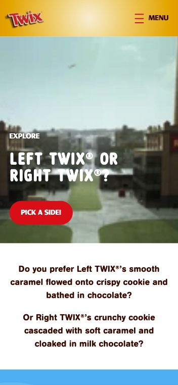
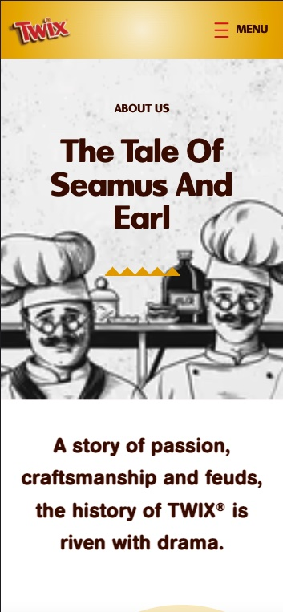
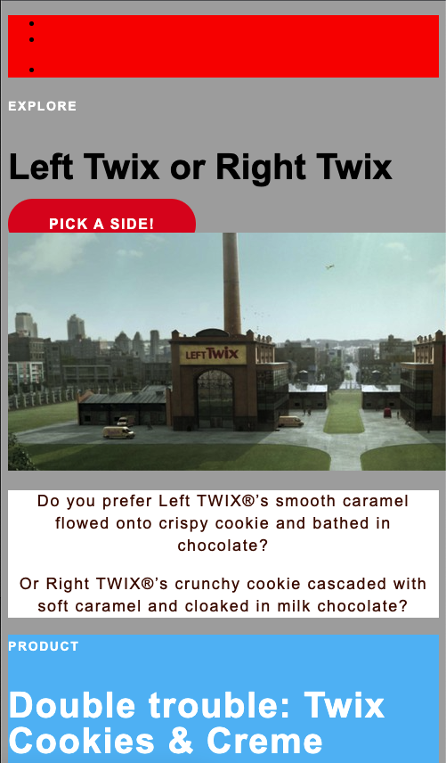

# Procesverslag
Markdown is een simpele manier om HTML te schrijven.  
Markdown cheat cheet: [Hulp bij het schrijven van Markdown](https://github.com/adam-p/markdown-here/wiki/Markdown-Cheatsheet).

Nb. De standaardstructuur en de spartaanse opmaak van de README.md zijn helemaal prima. Het gaat om de inhoud van je procesverslag. Besteedt de tijd voor pracht en praal aan je website.

Nb. Door *open* toe te voegen aan een *details* element kun je deze standaard open zetten. Fijn om dat steeds voor de relevante stuk(ken) te doen.

## Jij

uitwerken voor kick-off werkgroep

### Auteur:
Danian Marengo

#### Je startniveau:
Rood. Ik kan het wel, maar doordat ik het weinig doe is het hier wat vastgeroest ik. Als het lukt is coderen stiekem wel leuk. 

#### Je focus:
Surface plane
 

## Je website

uitwerken voor kick-off werkgroep

### Je opdracht:
https://www.twix.com

#### Screenshot(s) van de eerste pagina (small screen): 
Explore Twix

#### Screenshot(s) van de tweede pagina (small screen):
Our Story 

 

## Breakdownschets (week 1)

uitwerken na afloop 2e werkgroep

### de hele pagina: 

### dynamisch deel (bijv menu): 

### wellicht nog een dynamisch deel (bijv filter): 

## Voortgang 1 (week 2)

uitwerken voor 1e voortgang

### Stand van zaken

Op de afgelopen twee weken aan lesstof kan ik positief terugblikken. Ondanks dat ik het gevoel heb dat ik over een "oké" basis beschik
om aan de slag te gaan met mijn website, heb ik mij voorgenomen om mij vanaf de start te verdiepen in de oefeningen. Zelf toepassen is namelijk
een goede manier om een beter begrip te krijgen van de lesstof. 
 
Omdat ik mij vooral heb gericht op het begrijpen van de stof heb ik minder aandacht kunnen besteden aan mijn website zelf.

 
Wel heb ik een basis van de html neergezet en heb ik een aantal algemene stijlen toegevoegd. Door mijn aandacht vooral aan de
oefeningen te besteden hoop ik dat het programmeren van de website gemakkelijker verloopt.
 

 

### Agenda voor meeting
samen met je groepje opstellen

| Adam            | Coen            | Danian          | Shae       
| ---             | ---             | ---             | ---        
| Geen            | Geen            | Geen            | Geen
| bijzonderheden  | bijzonderheden  | bijzonderheden  | bijzonderheden

### Verslag van meeting
hier na afloop snel de uitkomsten van de meeting vastleggen
 
- Verstandig om de html zover mogelijk uit te werken voordat je begint aan het stijlen in css.
- Aantekeningen maken in zowel html als de css om het overzicht te behouden.
 
- Inspector via Safari, om fonts van organisaties te downloaden, vervolgens fontconverter.
 
- Parallax scrollen realiseren door "background-attachment: fixed".
 
- Codepen van de student assistenten ontvangen voor het creeëren van een hamburger menu. 
 

## Voortgang 2 (week 3)

uitwerken voor 2e voortgang

### Stand van zaken

Na drie weken is ben ik verder gegaan met het detailleren van de pagina. Zo heb ik het beeldmerk en het menu toegevoegd aan de navigatie.
Daarnaast heb de afbeelding van de twee Twix fabrieken opnieuw gepositioneerd met "Object-fit" en "object-position". Dit zorgt
ervoor de de afbeelding meeschaalt zonder dat het belangrijkste deel van de afbeelding uit het beeld verdwijnt.

 

 
Ondanks de visuele inspector blijft het af en toe lastig om bepaalde onderdelen na te maken. Over het deel van de Twix website wat
op onderstaande afbeelding te zien is had ik zo mijn twijfels. Dankzij Sanne zijn deze twijfels omgezet tot zekerheid en hoef ik mij
geen zorgen meer te maken over het uiterlijk tijdens het stijlen. 
 

 
Door mijn werkwijze is het zo dat de website zelf nog niet volledig is vormgegeven, wel heb ik de één van de uitkomsten van de
"voortgang 1 meeting" direct in mijn website verwerkt. Door een "background-attachment" toe te voegen aan de onderstaande afbeelding
lijkt het alsof de afbeelding op zijn plek blijft staan tijdens het scrollen. 

 
Nu dat er een goede basis staat is het tijd om de het stijlen af te ronden zodat we ons kunnen richten op de "socials", animaties en eventuele verbeteringen
aan de Twix website zelf, zodat we volgende week iets kunnen opleveren wat niet alleen af is, maar ook precies zoals we in gedachte hadden. 

### Agenda voor meeting
samen met je groepje opstellen

| Adam            | Coen                     | Danian                  | Shae       
| ---             | ---                      | ---                     | ---        
| Uitlijning      | Search button en Footer  | Uitwerking socials      | Slider

### Verslag van meeting
hier na afloop snel de uitkomsten van de meeting vastleggen

- Het zou natuurlijk helemaal geweldig zijn als de interactieve elementen als de carousel werken, aangezien we voor surface plane hebben gekozen. Maar Sanne heeft aangegeven dat het wat dat betreft voldoende is als de blokken kunnen scrollen. 
 
- Sanne heeft een soort gelijke carousel die Shae en ik nodig hebben gemaakt voor het van Gogh museum en heeft de code daarvan gedeeld om eventueel van te kunnen leren. 

## Toegankelijkheidstest (week 4)

uitwerken na test in 8e voortgang

De toegankelijkheidstest bestond uit drie onderdelen. Hoe goed de website te bedienen is met enkel het toetsenbord, hoe goed de website te gebruiken is met een screen reader en het bedienen van de website met een visuele beperking of problemen met de motoriek. In tweetallen hebben we elkaars website getest op basis van eerder genoemde punten. 
 
 
### Bevindingen
Lijst met je bevindingen die in de test naar voren kwamen:

#### Titel eerste bevinding
Hier korte omschrijving (met indien nodig een afbeelding)

Hier een omschrijving van hoe het opgelost kan worden (met indien nodig een afbeelding)

#### Titel tweede bevinding. 
Hier korte omschrijving (met indien nodig een afbeelding)

Hier een omschrijving van hoe het opgelost kan worden (met indien nodig een afbeelding)

#### Titel volgende bevinding. 
Hier korte omschrijving (met indien nodig een afbeelding)

Hier een omschrijving van hoe het opgelost kan worden (met indien nodig een afbeelding)

#### Titel nog een bevinding. 
Hier korte omschrijving (met indien nodig een afbeelding)

Hier een omschrijving van hoe het opgelost kan worden (met indien nodig een afbeelding)

## Voortgang 3 (week 4)

uitwerken voor 3e voortgang

### Stand van zaken
hier dit ging goed & dit was lastig (neem ook screenshots op van delen van je website en code)

### Agenda voor meeting
samen met je groepje opstellen

| Adam                | Coen                 | Danian                  | Shae       
| ---                 | ---                  | ---                     | ---        
| Stijling Navigatie  | Iconen in blokken    | 'After' op de headings  | Uit en inklapbare blokken tekst

### Verslag van meeting
hier na afloop snel de uitkomsten van de meeting vastleggen

- Achteraf bleek het te zijn dat Adam zijn navigatie moeilijk te stijlen was door de nesting van zijn "ul's". Deze zaten namelijk in "li's".

- In plaats van de pijlen als afbeeldingen in de "li's" plaatsen, is het efficiënter om ::after te gebruiken.
 
- Het blijkt lastiger te zijn dan gedacht om een "clip path" op de ::after van een heading te zetten. Yunus heeft aangegeven om hier later op terug te komen.
 
- Yunus heeft de code van zijn Apple website gedeeld om te laten zien hoe hij daar de uit en inklapbare blokken tekst heeft geprogrammeerd.
 
- Mede door Yunus is het Shae daarnaast ook gelukt om de datum weer te geven op haar website. 

## Eindgesprek (week 5)

uitwerken voor eindgesprek

### Stand van zaken
hier dit ging goed & dit was lastig (neem ook screenshots op van delen van je website en code)

### Screenshot(s)

hier screenshot(s) van je eindresultaat

## Bronnenlijst

continu bijhouden terwijl je werkt

Nb. Wees specifiek ('css-tricks' als bron is bijv. niet specifiek genoeg).

1. bron 1
2. bron 2
3. ...

